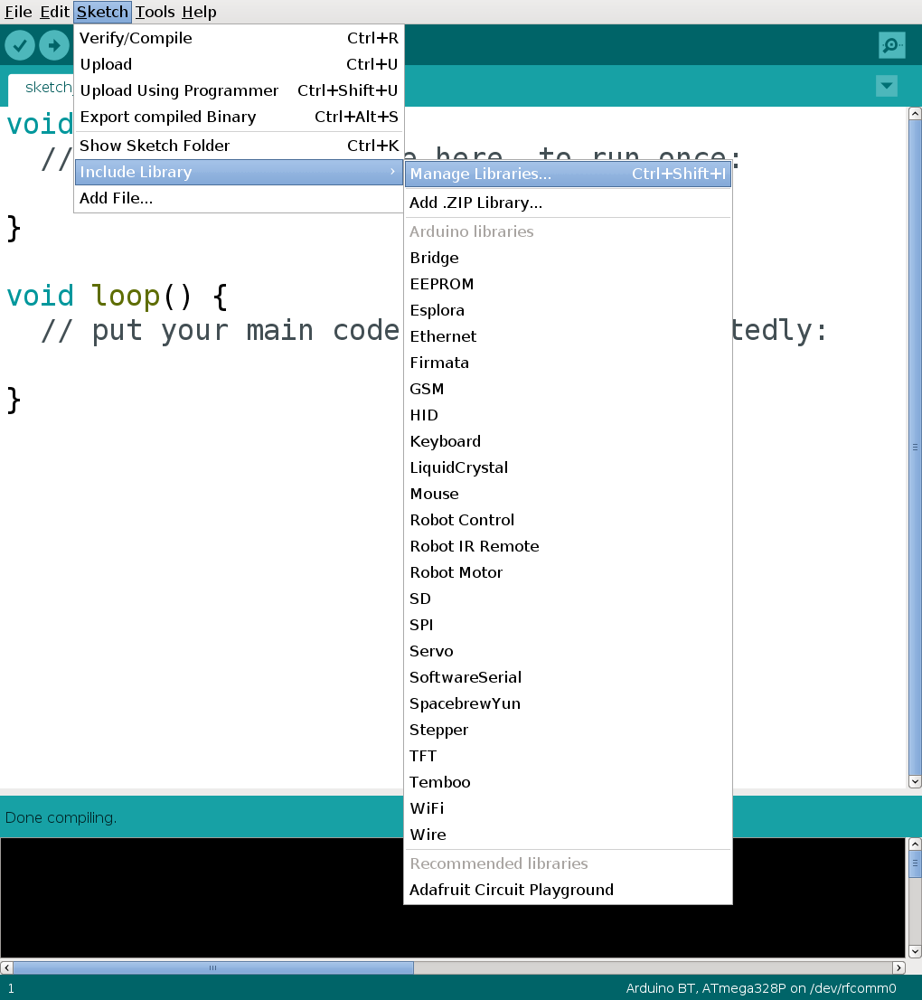
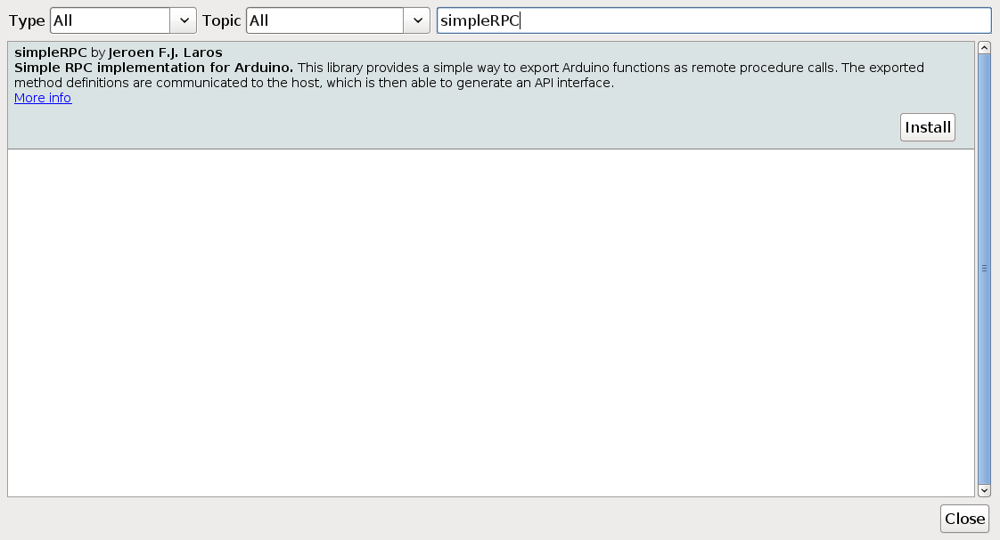
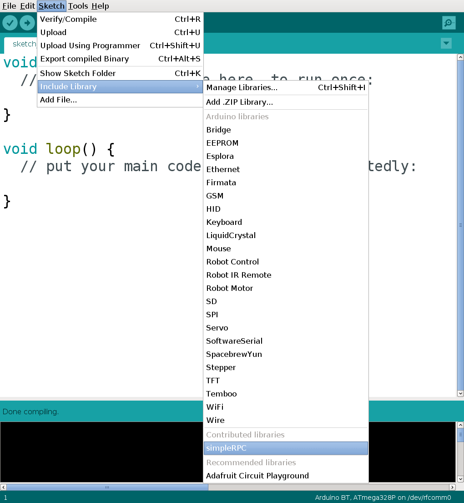

Installation
============

In this section we cover retrieval of the latest release or development version
of the code and subsequent installation for an Arduino device.

Arduino IDE
-----------

Installation via the `Arduino IDE`_ is probably the easiest way.

First open the Library Manager.

In the search bar, type "simpleRPC", click install and close the Library
Manager.

The simpleRPC library is now available in the "Contributed libraries" section.

Manual installation
-------------------

Download
^^^^^^^^

Latest release
~~~~~~~~~~~~~~

Navigate to the `latest release`_ and either download the ``.zip`` or the
``.tar.gz`` file.

Unpack the downloaded archive.

From source
~~~~~~~~~~~

The source is hosted on GitHub_, to install the latest development version, use
the following command.

::

    git clone https://github.com/jfjlaros/simpleRPC.git

Installation
^^^^^^^^^^^^

Arduino IDE
~~~~~~~~~~~

In the Arduino IDE, a library can be added to the list of standard libraries by
clicking through the following menu options.

- Sketch
- Import Library
- Add Library

To add the library, navigate to the downloaded folder and select the subfolder
named ``src``.

- Click OK.

Now the library can be added to any new project by clicking through the
following menu options.

- Sketch
- Import Library
- simpleRPC

Ino
~~~

Ino_ is an easy way of working with Arduino hardware from the command line.
Adding libraries is also easy, simply place the library in the ``lib``
subdirectory.

::

    cd lib
    git clone https://github.com/jfjlaros/simpleRPC.git

.. _Arduino IDE: https://www.arduino.cc/en/Main/Software
.. _GitHub: https://github.com/jfjlaros/simpleRPC.git
.. _Ino: http://inotool.org
.. _latest release: https://github.com/jfjlaros/simpleRPC/releases/latest
